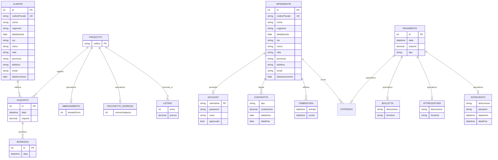

# Schema concettuale E/R — GymDashboard

**Fonti:** `01-requisiti.md`, `CONTEXT.md`, linee guida `docs/db-guidelines/03-modello-er.md` e `04-progettazione-concettuale.md`.  
**Allineamento:** schema concettuale target; mapping logico/Prisma in `03-schema-logico.md`.

## Quando usare questo documento

Base per la relazione (progettazione concettuale) e per verificare che lo schema logico/Prisma resti fedele.

## Diagramma E/R (vista d’insieme)

> **Nota notazione:** il diagramma Mermaid è una vista sintetica. Cardinalità, identificatori esterni e copertura delle gerarchie sono specificati sotto (fonte di verità per la relazione).

## Entità e attributi

### CLIENTE

| Attributo | Note |
|---|---|
| Id | Identificatore interno surrogato |
| CodiceFiscale | Identificatore interno alternativo (UNIQUE) |
| Nome, Cognome, DataNascita | |
| Indirizzo (composto) | Via, Civico, Città, Provincia |
| Telefono, Email | |
| DataIscrizione | |

Identificatori: `{Id}`; `{CodiceFiscale}`.

Niente contatore di ingressi sul Cliente: il residuo da pacchetto è derivabile dagli Acquisti di Pacchetto e dagli Ingressi che li giustificano (vedi regole e `03-schema-logico.md`).

### DIPENDENTE

Stessi attributi anagrafici di CLIENTE + `DataAssunzione`.

Identificatori: `{Id}`; `{CodiceFiscale}`.

Anagrafiche simili a CLIENTE, ma **senza** generalizzazione PERSONA in questo schema: cicli di vita e associazioni restano disgiunti (iscrizione/acquisti/ingressi vs assunzione/contratti/timbrature/account). La stessa persona fisica può essere sia cliente sia dipendente come due istanze distinte — con PERSONA (t,e) sarebbe vietato.

### ACCOUNT

| Attributo | Note |
|---|---|
| Username | PK |
| Password | |
| Ruolo | dominio {Amministratore, Dipendente} |
| Approvato | default falso |

### CONTRATTO

| Attributo | Note |
|---|---|
| Tipo | {Tempo determinato, Tempo indeterminato} |
| CostoOrario | importo monetario |
| DataInizio | parte dell’identificatore |
| DataFine | opzionale (0,1) |

### TIMBRATURA

| Attributo | Note |
|---|---|
| Entrata | datetime; parte dell’identificatore |
| Uscita | opzionale (0,1) finché il turno è aperto |

### PRODOTTO

Solo `Codice` (PK). Specializzazioni sotto. Il tipo (Abbonamento vs Pacchetto) è determinato dalla specializzazione, non da un attributo ridondante su Listino/Acquisto.

### ABBONAMENTO (figlia di PRODOTTO)

`Durata` (giorni), obbligatoria.

### PACCHETTO_INGRESSI (figlia di PRODOTTO)

`NumeroIngressi`, obbligatorio.

### LISTINO

| Attributo | Note |
|---|---|
| Anno | parte PK con Prodotto |
| Prezzo | importo monetario |

### ACQUISTO

| Attributo | Note |
|---|---|
| Id | Identificatore surrogato (evento economico) |
| Data | datetime dell’evento |
| Importo | snapshot monetario alla vendita (vedi regola 12); non sostituito da join al Listino |
| Durata | snapshot opzionale (giorni) se il Prodotto era Abbonamento alla vendita |
| NumeroIngressi | snapshot opzionale se il Prodotto era Pacchetto alla vendita |

Pattern visite/reificazione (`03-modello-er.md`): Acquisto è entità evento, non sola associazione N:M Cliente–Prodotto. Durata/N sono fatti storici (come Importo): un update sul Prodotto non riscrive Acquisti già emessi.

### INGRESSO

| Attributo | Note |
|---|---|
| Id | Identificatore surrogato (evento di accesso) |
| Data | datetime dell’evento |

Reifica l’accesso in palestra (eventi ripetibili). Il Cliente si raggiunge navigando l’Acquisto che giustifica l’ingresso — niente associazione diretta Cliente–Ingresso (eviterebbe un ciclo ridondante con `Acquisto.Cliente`).

### PAGAMENTO

| Attributo | Note |
|---|---|
| Id | PK surrogato |
| Data, Importo, Tipo | Tipo ∈ {Stipendio, Bolletta, Attrezzatura, Intervento} |

### Specializzazioni di PAGAMENTO

| Entità | Attributi propri |
|---|---|
| STIPENDIO | (nessuno oltre al legame a Dipendente) |
| BOLLETTA | Descrizione, Fornitore (stringa) |
| ATTREZZATURA | Descrizione, Fornitore (stringa) |
| INTERVENTO | Descrizione, Attuatore, DataInizio, DataFine |

Bolletta e Attrezzatura hanno attributi strutturalmente uguali ma semantica diversa (utenza/servizio vs spesa per attrezzatura): restano **due figlie** dell’ISA, non collassate.  
`Fornitore` è attributo (etichetta sulla spesa), non entità: nel dominio non c’è anagrafica/ciclo di vita del fornitore; aggregazioni per nome bastano. Si reificherebbe solo se servisse identità canonica (P.IVA, contatti, deduplica nomi).

## Generalizzazioni

### PRODOTTO → ABBONAMENTO | PACCHETTO_INGRESSI

- Copertura: **(t, e)** totale esclusiva  
- Ogni prodotto è esattamente un abbonamento o un pacchetto.

### PAGAMENTO → STIPENDIO | BOLLETTA | ATTREZZATURA | INTERVENTO

- Copertura: **(t, e)** totale esclusiva  
- Il selettore coincide con l’attributo `Tipo` di PAGAMENTO (collasso verso l’alto in logica).

## Alternative modellistiche (non adottate)

| Alternativa | Esito | Motivazione breve |
|---|---|---|
| `PERSONA` (t,e) → Cliente \| Dipendente | Solo **variante in relazione** | Ruoli e associazioni divergono; (t,e) esclude la stessa persona fisica in entrambi i ruoli |
| Entità `FORNITORE` | **No** | Nessun ciclo di vita proprio; stringa sufficiente per report per nome |
| Contatore residuo su Acquisto | **No** | Residuo = `N − COUNT`; denormalizzazione solo se misure di carico lo richiedono |
| `TitoloAccesso` distinto da Acquisto | **No** | Coinciderebbe ~1:1 con Acquisto |
| Collasso Bolletta + Attrezzatura | **No** | ISA a quattro tipi; semantica distinta nonostante attributi uguali |
## Associazioni e cardinalità

| Associazione | Entità | Card. | Entità | Card. | Attributi |
|---|---|---|---|---|---|
| POSSESSO | DIPENDENTE | (0,1) | ACCOUNT | (1,1) | — |
| STIPULA | DIPENDENTE | (1,N) | CONTRATTO* | (1,1) | vedi attributi CONTRATTO |
| TIMBRA | DIPENDENTE | (1,N) | TIMBRATURA* | (1,1) | Entrata, Uscita |
| EFFETTUA_ACQUISTO | CLIENTE | (0,N) | ACQUISTO | (1,1) | Data, Importo |
| OGGETTO_ACQUISTO | PRODOTTO | (0,N) | ACQUISTO | (1,1) | — |
| GIUSTIFICA | ACQUISTO | (0,N) | INGRESSO | (1,1) | Data (su Ingresso) |
| PREZZO | PRODOTTO | (0,N) | LISTINO* | (1,1) | Anno, Prezzo |
| EROGAZIONE | DIPENDENTE | (0,N) | STIPENDIO | (1,1) | — |

\* Entità **deboli** / identificate esternamente rispetto al “proprietario” indicato (Contratto, Timbratura, Listino).

Lettura compatta:

- Un Dipendente **può** non avere Account; un Account **deve** riferirsi a un Dipendente.
- Un Cliente **può** non avere ancora acquisti; gli ingressi esistono solo se giustificati da un Acquisto.
- Un Prodotto **può** non avere ancora righe di listino o acquisti.
- Un Acquisto **può** non avere ancora ingressi collegati (abbonamento appena comprato, pacchetto non ancora usato).
- Preferenza alle binarie rispetto a una ternaria Cliente–Acquisto–Ingresso: ogni Ingresso determina esattamente un Acquisto (max-card 1) → falsa ternaria (`03-modello-er.md`).

## Identificatori (riepilogo)

| Entità | Identificatore principale | Alternative / note |
|---|---|---|
| CLIENTE | Id | CodiceFiscale |
| DIPENDENTE | Id | CodiceFiscale |
| ACCOUNT | Username | — |
| CONTRATTO | (Dipendente, DataInizio) | esterno composto |
| TIMBRATURA | (Dipendente, Entrata) | esterno composto |
| PRODOTTO | Codice | — |
| ABBONAMENTO / PACCHETTO | Codice (= Prodotto) | debole / 1:1 con padre |
| LISTINO | (Anno, Prodotto) | |
| ACQUISTO | Id | surrogato; non (Cliente, Data) |
| INGRESSO | Id | surrogato; FK obbligatoria ad Acquisto |
| PAGAMENTO | Id | |
| STIPENDIO… | Id Pagamento | 1:1 con padre; Stipendio anche FK Dipendente |

## Regole aziendali (vincoli non grafici)

1. `Account.Approvato = false` ⇒ autenticazione negata.
2. `Ruolo = Amministratore` ⇒ Account comunque su un Dipendente esistente.
3. Il tipo di un Acquisto/Listino è quello della specializzazione del Prodotto collegato (niente attributo `Tipo` ridondante).
4. Timbratura: non esistono due Timbrature dello stesso Dipendente con `Uscita` NULL contemporaneamente (turno aperto unico); il tornello evita entrata–entrata.
5. `Timbratura.Uscita` se valorizzata ⇒ `Uscita ≥ Entrata`.
6. `Intervento.DataFine ≥ DataInizio`.
7. Contratto:
	- tempo indeterminato: `DataFine` assente; tempo determinato: `DataFine` valorizzata e ≥ `DataInizio`;
	- **non sovrapposizione:** per lo stesso Dipendente, gli intervalli `[DataInizio, DataFine)` (con `DataFine` assente trattata come +∞) sono a due a due disgiunti (app/CHECK; non esprimibile solo con la PK).
8. Ogni Ingresso **deve** riferirsi a un Acquisto dello stesso Cliente (via `Acquisto.Cliente`) che giustifica l’accesso all’istante `Ingresso.Data`.
9. Scelta dell’Acquisto giustificatore (**una transazione**, vedi `03-schema-logico.md`):
	- candidati Abbonamento: Acquisti di Abbonamento del Cliente con `Ingresso.Data ∈ [DataAcquisto, DataAcquisto + Durata)`;
	- se ce n’è almeno uno → scegliere quello con `DataAcquisto` **più recente**; in parità, `Id` maggiore (nessun consumo pacchetto);
	- altrimenti candidati Pacchetto: Acquisti di Pacchetto con `residuo > 0`; scegliere quello con `DataAcquisto` **meno recente** (FIFO); in parità, `Id` minore;
	- se nessun candidato → rifiutare l’ingresso.
10. Integrità ISA (t,e): per ogni Pagamento esiste esattamente una riga figlia coerente con `Tipo`; per ogni Prodotto esiste esattamente una tra Abbonamento e Pacchetto ingressi.
11. Attrezzatura è **spesa**, non giacenza di magazzino.
12. `Acquisto.Importo` è lo **snapshot** dell’importo alla vendita (storico cassa). Di default coincide con `Listino.Prezzo` del Prodotto per `anno = YEAR(DataAcquisto)`; può differire solo per sconto/deroga esplicita in operazione. Non è una FK al Listino: il listino può cambiare in seguito senza riscrivere la storia.
13. Cancellazioni che preservano la storia economica (**RESTRICT**):
	- Prodotto con Acquisti esistenti;
	- Cliente con Acquisti esistenti;
	- Acquisto con Ingressi esistenti.
	Eliminazioni anagrafiche/cassa solo con procedura amministrativa esplicita (non cascade silenzioso).

## Qualità dello schema (autovalutazione)

| Criterio | Stato |
|---|---|
| Correttezza | Allineato a requisiti ristrutturati e a pattern visite/reificazione delle linee guida |
| Completezza | Copre proposta + estensioni + giustificazione accesso + vincoli temporali/cassa |
| Leggibilità | Gerarchie e deboli esplicitate; Mermaid di supporto |
| Minimalità | Nessun `TitoloAccesso` (~1:1 con Acquisto); nessun contatore globale su Cliente |

## Prossimi passi

1. Dettaglio logico, delete policy, transazione ingresso: `03-schema-logico.md`.
2. Migrazione DB e aggiornamento CRUD applicazione.
